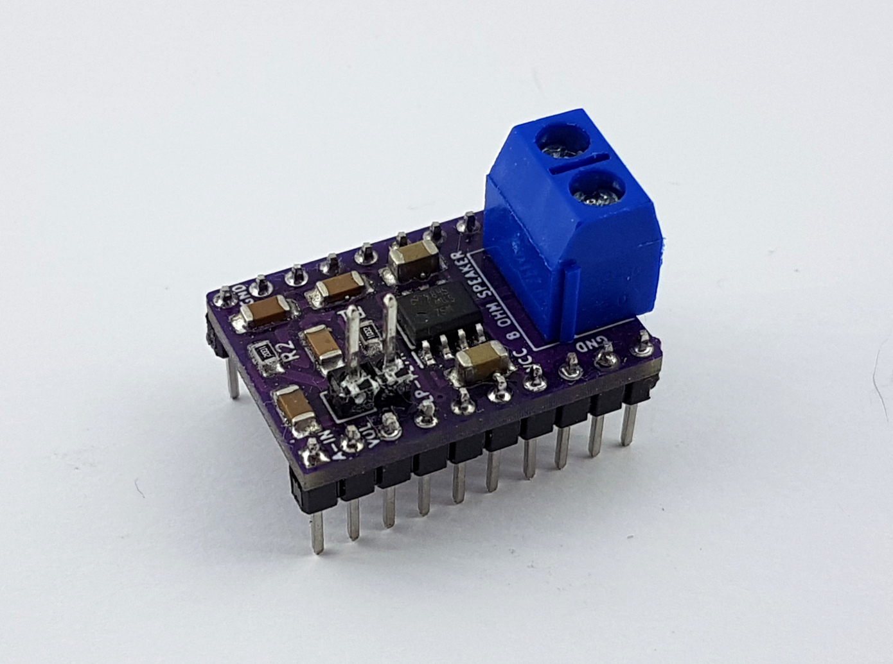
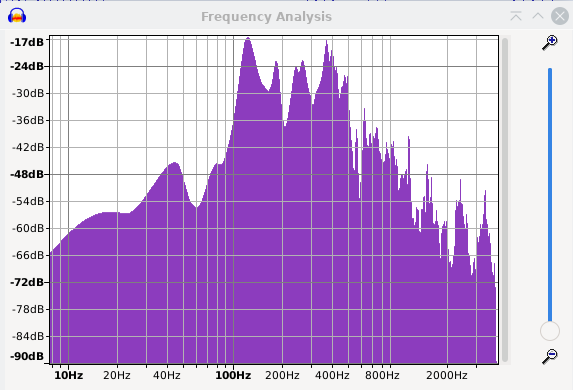
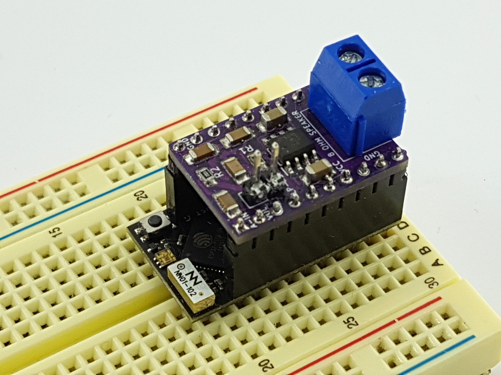

## Make your ESP32 talk

Give your robots a `voice` with the `Arduino Talkie Speech Amplifier` and the Arduino [library Talkie](https://github.com/ArminJo/Talkie). The compact size of Unexpected Maker's `ESP32 TinyPICO` and the `speech Amplifier` makes it possible to squeeze in the combination in a tiny space. In addition, the amplifier drives a small attached 8-32 Ohm speaker. 

Mounting the shield on top of the TinyPICO avoids all mess with cables.
With `ESP32 WiFi` and `OTA`, there is a possibility to update the code (firmware) without the need to disassemble the robot. Please, see the example directory for the OTA code sample. The amplifier has a built-in voice filter to limit unnecessary high frequencies. Bypass this with a jumper to get the total frequency of the amplifier LM4875. The second DAC, on pin 26, can be used to digitally control the `Arduino Talkie Speech Amplifier's` volume.

## The miniature speech amplifier shield for ESP32 robotics

Let your robot use your created word or sentences, or use the pre-defined 1200+ sounds and phrases from the `Talkie` library. The fun begins when using the `Talkie` library.

Use the `wav-samples-files` to experiment with converting them to be playable by `Talke` voice playback.

Use my [Wav-to-LPC conversion guide](https://github.com/berrak/wav-files-to-arduino-talkie-lpc) to avoid common pitfalls when converting your `wav-files` recordings.

## Explore sounds and pre-defined words

Find **talkie-vocab.sh** shell script in the `script` directory. Use this to easily browse existing sounds, words, and phrases available once you install the Arduino library `Talkie`.

## Board main features

The `Arduino Talkie Speech Amplifier` uses Texas Instrument's LM4875 chip and amplifies the DAC signal from `ESP32 TinyPICO` GPIO25. GPIO26 can be either connected to 3.3V for maximum gain or digitally controlled by the second DAC in the ESP32.

- Built-in optimized speech signal input filter, but can optionally be bypassed with `jumper J1` on board.
- With the Amplifier shield, there is no risk of wiring it up incorrectly.
- Control speaker volume from microcontroller DAC.
- This device comes fully assembled and tested.
- The onboard LM4875 chip is a class AB analog amplifier (mono) with up to 750 mW output.
- The ESP32 board powers the shield and the LM4875 with 3.3V.
- Only GPIO25 (analog in), GPI26 (volume control), GND, and 3.3V pins connect electrically to the Amplifier shield.

*Analyzing the spectral voice output reveals that amplifying higher frequencies is
wasteful and does not add to the final voice output. The filter cut higher frequencies.*

## Planned Improvements/Changes

For planned changes, improvements, and possible encountered issues, please visit the [Github issues tracker](https://github.com/berrak/Arduino-Talkie-Speech-Amplifier/issues).

## Suggested items to add to the board

- Unexpected Maker's ESP32 TinyPICO microcontroller.
- Female headers for ESP32 TinyPICO.
- Loudspeaker element, 8-32 Ohm.

Purchase UM TinyPico ESP32 at [Pimoroni](https://shop.pimoroni.com/products/tinypico-v2?variant=39285089534035) or [Adafruit](https://www.adafruit.com/?q=TinyPico+ESP32&sort=BestMatch). Do not use the ESP32S2 or ESP32S3 models (not tested).

## Usage

Add the Amplifier shield board to the `ESP82 TinyPICO` so that the screw terminal is above the USB connector. Next, connect an 8-32 Ohm speaker element to the screw terminal.

- Connect power to the shield once it is confirmed correctly plugged in! 

Please, see the [Arduino library installation documentation](https://docs.arduino.cc/software/ide-v1/tutorials/installing-libraries) and how to install the Arduino library [Talkie](https://github.com/ArminJo/Talkie/).

Try one of the sketches in the `example` directory, for example, my `hello.ino` or `goodmorning.ino`. Then, use Over-The-Air (OTA) to remotely update the ESP32 TinyPICO robot. See the example `updaterobotOTA` for a start.

Other usages than robotics may be a customized keyboard pad with voice reply for entering a building, adding sounds to a game, which was original use in the 70s/or early 80s, or a keyboard trainer.

**Note**: Connect 3.3V to the Amplifier pin marked `VOL` (i.e., maximum gain) if not using the second DAC to control volume.

## Specification for the Arduino Talkie Speech Amplifier v1.0.

* Operating voltage: 3.3V externally or via the TinyPICO ESP32.
* The shield size is 17.8 x 25.3 mm (0.7" x 1") and fabricated as a two-layer board.
* Board thickness: 1.6 mm (63 mils).
* Formfactor and pinout: Unexpected Maker TinyPICO.
* Weight: 5 gram (0.18 ounce).
* Height: 20 mm (0.79")

## Purchase the board

The `Arduino Talkie Speech Amplifier` board is available only fully assembled. `Tindie` has all the latest designed boards.

I appreciate your support.

## FAQ

**Q**: Can I use a microphone with the speech amplifier without the ESP32 TinyPICO?
**A**: Theoretically, yes, but this is discouraged for several reasons. It's essential to keep the distance short between the microphone and amplifier input. All amplified system is susceptible to picking up noise from the environment, noise from built-in microphone amplifier, and ground-current loops. A breadboard setup is not recommended, which *may* result in unwanted buzzing or humming or even an audio positive audio feedback loop with high pitch sound in the speakers. 

## Credits

Thanks to `Peter Knight` and the original version of the [Talkie library](https://github.com/going-digital/Talkie).
Thanks to `Armin Joachimsmeyer` for his refurbished version of the Arduino [Talkie speech library](https://github.com/ArminJo/Talkie).

